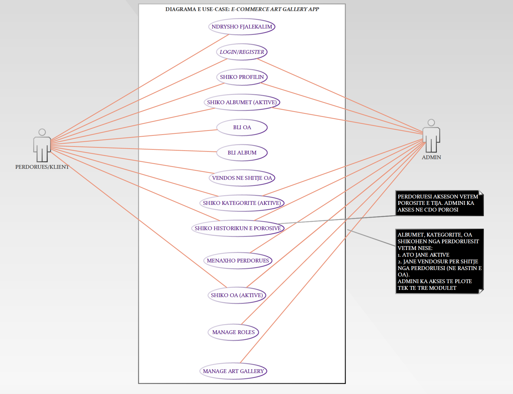

# Virtual Art Gallery 
MSc Project E-Commerce Course PayPal Integration

Open project in terminal *<YOUR_PATH>/CreativeArtistsE-Commerce2017/creative-artists-e-commerce*

Run *composer install* before running code

Run *php artisan serve* 

